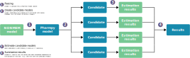

.. _pharmpy_tools:

=====
Tools
=====

A tool in Pharmpy is an implementation of a pharmacometric method. The Pharmpy tools typically create multiple
candidate models according to the tool selected, estimate those, and make some sort of selection of the best model. If
possible, Pharmpy will parallelize the runs. All tools are independent of the estimation software chosen, the only part
of the tool that is software specific is the estimation.

The tools can be split into two sections: Pharmpy tools and tools connected to PsN. Pharmpy tools
are implemented in Pharmpy, while the tools connected to PsN allows for parsing and presenting
results from PsN tools. Documentation of PsN tools can be found :ref:`here <psn_with_pharmpy>`.

~~~~~~~~~~~~~~~~
Tools in Pharmpy
~~~~~~~~~~~~~~~~

.. note::

    In order to run any of the tools you need to have a configuration file set up with a path to NONMEM, instructions
    can be found :ref:`here <config_page>`.

.. toctree::
   :maxdepth: 2

   General <general>
   AMD - automatic model development <amd>
   Modelsearch - search for best structural model for a PK model <modelsearch>
   Structsearch - search for best structural model for PKPD, drug metabolite and TMDD models <structsearch>
   IIVsearch - search for best IIV structure (both variance and covariance) <iivsearch>
   IOVsearch - search for best IOV structure and trim IIV <iovsearch>
   COVsearch - identify covariates that explain some of the IIV <covsearch>
   RUVsearch - search for best residual error model <ruvsearch>
   allometry - add allometric scaling <allometry>
   estmethod - compare estimation methods and/or solvers <estmethod>
   Retries - Rerun a model with tweaked initial estimates <retries>
   Simulation - Run a simulation <simulation>

~~~~~~~~~~~~~~
Common options
~~~~~~~~~~~~~~

In addition to the tool specific options, there are some options that all tools have in common.

+------------+---------------------------------------------+
| Argument   | Description                                 |
+============+=============================================+
| ``path``   | Path to create (or resume in) tool database |
+------------+---------------------------------------------+
| ``resume`` | Flag whether to resume an existing tool run |
+------------+---------------------------------------------+
