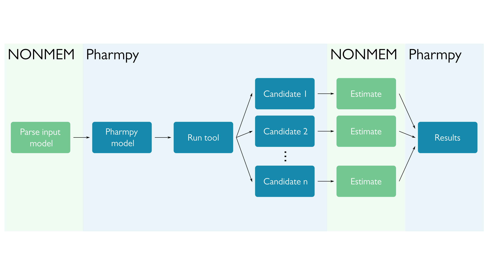

.. _pharmpy_tools:

=====
Tools
=====

A tool in Pharmpy is an implementation of a pharmacometric method. The Pharmpy tools typically create multiple
candidate models according to the tool selected, estimate those, and make some sort of selection of the best model. If
possible, Pharmpy will parallelize the runs. All tools are independent of the estimation software chosen, the only part
of the tool that is software specific is the estimation.

The tools can be split into two sections: Pharmpy tools and tools connected to PsN. Pharmpy tools
are implemented in Pharmpy, while the tools connected to PsN allows for parsing and presenting
results from PsN tools. Documentation of PsN tools can be found :ref:`here <psn_with_pharmpy>`.

~~~~~~~~~~~~~~~~
Tools in Pharmpy
~~~~~~~~~~~~~~~~

.. note::

    In order to run any of the tools you need to have a configuration file set up with a path to NONMEM, instructions
    can be found :ref:`here <config_page>`.

.. toctree::
   :maxdepth: 1

   AMD - automatic model development <amd>
   Modelsearch - search for best structural model for a PK model <modelsearch>
   IIVsearch - search for best IIV structure (both variance and covariance) <iivsearch>
   IOVsearch - search for best IOV structure and trim IIV <iovsearch>
   COVsearch - identify covariates that explain some of the IIV <covsearch>
   RUVsearch - search for best residual error model <ruvsearch>
   allometry - add allometric scaling <allometry>
   estmethod - compare estimation methods and/or solvers <estmethod>

~~~~~~~~~~~~~~
Common options
~~~~~~~~~~~~~~

In addition to the tool specific options, there are some options that all tools have in common.

+------------+---------------------------------------------+
| Argument   | Description                                 |
+============+=============================================+
| ``path``   | Path to create (or resume in) tool database |
+------------+---------------------------------------------+
| ``resume`` | Flag whether to resume an existing tool run |
+------------+---------------------------------------------+

~~~~~~~~~~~~~~~
Common features
~~~~~~~~~~~~~~~

.. note::

    The AMD tool is a collection of tools, meaning that some aspects of this section may not be applicable. For
    example, datasets will be in the database for each subtool.

.. _tool_database:

Tool database
~~~~~~~~~~~~~

When running a tool, all candidate models and their corresponding files are stored in a tool database. As an example,
using the Modelsearch tool with NONMEM for estimation, a tool database might look like this:

.. code-block::

    modelsearch_dir1/
    ├── metadata.json
    ├── models
    │   ├── .datasets
    │   │   ├── .hash
    │   │   │   └── ...
    │   │   ├── modelsearch_candidate1.csv
    │   │   ├── modelsearch_candidate1.datainfo
    │   │   ├── modelsearch_candidate2.csv
    │   │   └── modelsearch_candidate2.datainfo
    │   ├── modelsearch_candidate1
    │   │   ├── modelsearch_candidate1.ext
    │   │   ├── modelsearch_candidate1.lst
    │   │   ├── modelsearch_candidate1.mod
    │   │   ├── modelsearch_candidate1.phi
    │   │   ├── mytab_mox1
    │   │   ├── nonmem.json
    │   │   ├── .pharmpy
    │   │   │   └── ...
    │   │   ├── stderr
    │   │   └── stdout
    │   ├── modelsearch_candidate2
    │   │   └── ...
    │   ├── modelsearch_candidate3
    │   │   └── ...
    │   └── modelsearch_candidate4
    │       └── ...
    ├── results.csv
    └── results.json

The top level ``modelsearch_dir1/`` will contain files relevant for the whole tool, such as metadata and results.
The subdirectory ``models/`` will contain subfolders for each model candidate, as well as a directory for all unique
datasets from the tool (see :ref:`tool_datasets`). Each candidate directory will contain the resulting NONMEM files, as
well as NONMEM output in ``stderr`` and ``stdout``.

Running directory
=================

.. note::
    This information is for NONMEM runs as it is the only estimation software currently fully supported for running
    tools.

All tools are run in a temporary directory. This means, when Pharmpy starts a tool, the model candidates and their
datasets will be written to the temporary directory, and all estimations will be started there. When model has been
estimated, it will be copied to the tool database. The dataset will also be copied to ``.datasets/`` `if that dataset
has not been stored in the database yet`. Which dataset that is copied is dependent on which of the candidate models
that have finished running first. See :ref:`tool_datasets` for more information.

Results
~~~~~~~

In general, the result objects will consist of a collection of summary tables. These can be accessed directly in your
script:

.. pharmpy-code::

    res = run_modelsearch('ABSORPTION(ZO);PERIPHERALS(1)',
                          'reduced_stepwise',
                          model=start_model,
                          results=start_model_results,
                          iiv_strategy='absorption_delay',
                          rank_type='bic',
                          cutoff=None)
    res.summary_models

For a more detailed description of which results are available, please check the documentation for each tool.

Additionally, Pharmpy will create at least two files: ``results.csv`` and ``results.json``. The .csv is intended as
a way to quickly look over your results, while the .json is a way to recreate the results object. This allows for
access to the different summary tables as data frames, and is intended to use to programmatically interact with the
results.

.. pharmpy-code::

    res = read_results('path/to/results.json')
    res.summary_models

It is also possible to read in models from the :ref:`tool_database` via the :py:func:`pharmpy.tools.retrieve_models`
function.

Metadata
~~~~~~~~

For each tool run, a metadata file ``metadata.json`` will be created. This contains information about start- and end
time, which options were used, which Pharmpy version etc. Example of metadata-file:

.. pharmpy-execute::
    :hide-code:

    with open('tests/testdata/results/metadata.json') as f:
        print(f.read())

.. _tool_datasets:

Datasets
~~~~~~~~

Pharmpy will create a directory ``.datasets/`` where any unique datasets the tool creates will be stored. An example
of this is when running Modelsearch and having zero order absorption in the search space, a RATE column will be
created. If any of the stepwise algorithms are used, the subsequent models will have the "same" dataset, and thus only
one copy of that dataset will be located in ``.datasets/``.

.. _mfl:

Model feature language (MFL)
~~~~~~~~~~~~~~~~~~~~~~~~~~~~

The `MFL` is a domain specific language designed to describe model features and sets of model features in a concise way.
It can be used to describe model features for one single model or an entire space of model features, i.e. descriptions
for multiple models. The basic building block of MFL is the feature description. A feature description consists of the
name of a feature category followed by a comma separated list of arguments within parentheses. For example:

.. code::

    ABSORPTION(FO)

Each feature description describes one or multiple features of the same category, i.e. absorption, absorption delay,
elimination, and distribution. Features of the same category are mutually exclusive and cannot be applied to the same
model. Multiple model feature descriptions can be combined by separating them with either newline or a semi-colon.

The following two examples are equivalent:

.. code::

    ABSORPTION(FO);ELIMINATION(ZO)

.. code::

    ABSORPTION(FO)
    ELIMINATION(ZO)

Option types
============

MFL support the following types of options to feature descriptions:

+---------------+------------------+-------------------------------------------------------+
| Type          | Example          | Description                                           |
+===============+==================+=======================================================+
| token or name | :code:`FO`       | The name of a feature within a category               |
+---------------+------------------+-------------------------------------------------------+
| number        | :code:`1`        | A non-negative integer                                |
+---------------+------------------+-------------------------------------------------------+
| range         | :code:`0..2`     | A range of numbers (endpoints are included)           |
+---------------+------------------+-------------------------------------------------------+
| wildcard      | :code:`*`        | All features of a category                            |
+---------------+------------------+-------------------------------------------------------+
| array         | :code:`[FO, ZO]` | Multiple tokens or numbers                            |
+---------------+------------------+-------------------------------------------------------+
| symbol        | :code:`@IIV`     | A symbol with manual or automatic definition          |
+---------------+------------------+-------------------------------------------------------+

Model features
==============

MFL support the following model features:

+---------------+-------------------------------+--------------------------------------------------------------------+
| Category      | Options                       | Description                                                        |
+===============+===============================+====================================================================+
| ABSORPTION    | :code:`FO, ZO, SEQ-ZO-FO`     | Absorption rate (first order, zero order, sequential               |
|               |                               | zero order first order)                                            |
+---------------+-------------------------------+--------------------------------------------------------------------+
| ELIMINATION   | :code:`FO, ZO, MM, MIX-FO-MM` | Elimination rate (first order, zero order, Michaelis-Menten,       |
|               |                               | mixed first order Michaelis-Menten)                                |
+---------------+-------------------------------+--------------------------------------------------------------------+
| PERIPHERALS   | `number`                      | Number of peripheral compartments                                  |
+---------------+-------------------------------+--------------------------------------------------------------------+
| TRANSITS      | `number`, DEPOT/NODEPOT       | Number of absorption transit compartments. Whether convert depot   |
|               |                               | compartment into a transit compartment                             |
+---------------+-------------------------------+--------------------------------------------------------------------+
| LAGTIME       | None                          | Absorption lagtime                                                 |
+---------------+-------------------------------+--------------------------------------------------------------------+
| COVARIATE     | `parameter`, `covariate`,     | Covariate effects                                                  |
|               | `effect`                      |                                                                    |
+---------------+-------------------------------+--------------------------------------------------------------------+

.. _mfl_symbols:

Symbols
=======

The MFL supports certain automatically defined symbols that help with
automating feature declaration. Currently, the only use of such symbols lies in
declaring covariate effects via the syntax `COVARIATE(@SYMBOL, ...)`.

+-----------------+-------------+---------------------------------------------+
| Symbol          | Type        | Description of automatic definition         |
+=================+=============+=============================================+
| `@IIV`          | Parameter   | All parameters with a corresponding IIV ETA |
+-----------------+-------------+---------------------------------------------+
| `@ABSORPTION`   | Parameter   | All PK absorption parameters                |
+-----------------+-------------+---------------------------------------------+
| `@ELIMINATION`  | Parameter   | All PK elimination parameters               |
+-----------------+-------------+---------------------------------------------+
| `@DISTRIBUTION` | Parameter   | All PK distribution parameters              |
+-----------------+-------------+---------------------------------------------+
| `@CONTINUOUS`   | Covariate   | All continuous covariates                   |
+-----------------+-------------+---------------------------------------------+
| `@CATEGORICAL`  | Covariate   | All categorical covariates                  |
+-----------------+-------------+---------------------------------------------+

New symbols can be manually defined via the syntax `LET(SYMBOL, [...])`. The
same syntax can be used to override the automatic definition of a symbol. For
instance, to declare an explicit list of distribution parameters use
`LET(DISTRIBUTION, [V, K12, K21])`.

Describe intervals
==================

It is possible to use ranges and arrays to describe the search space for e.g. transit and peripheral compartments.

To add 1, 2 and 3 peripheral compartments:

.. code::

    TRANSITS(1)
    TRANSITS(2)
    TRANSITS(3)

This is equivalent to:

.. code::

    TRANSITS(1..3)

As well as:

.. code::

    TRANSITS([1,2,3])

Redundant descriptions
======================

It is allowed to describe the same feature multiple times, however, this will not make any difference for which
features are described.

.. code::

    ABSORPTION(FO)
    ABSORPTION([FO, ZO])

This is equivalent to:

.. code::

    ABSORPTION([FO, ZO])

And:

.. code::

    PERIPHERALS(1..2)
    PERIPHERALS(1)

Is equivalent to:

.. code::

    PERIPHERALS(1..2)

Examples
========

An example of a search space for PK models with oral data:

.. code::

    ABSORPTION([ZO,SEQ-ZO-FO])
    ELIMINATION([MM,MIX-FO-MM])
    LAGTIME()
    TRANSITS([1,3,10],*)
    PERIPHERALS(1)

An example of a search space for PK models with IV data:

.. code::

    ELIMINATION([MM,MIX-FO-MM])
    PERIPHERALS([1,2])

Search through all available absorption rates:

.. code::

    ABSORPTION(*)

Allow all combinations of absorption and elimination rates:

.. code::

    ABSORPTION(*)
    ELIMINATION(*)

All covariate effects on parameters with IIV:

.. code::

    COVARIATE(@IIV, @CONTINUOUS, *)
    COVARIATE(@IIV, @CATEGORICAL, CAT)

With fixed lists of covariates for which to add effects:

.. code::

    LET(CONTINUOUS, [AGE, WGT])
    LET(CATEGORICAL, SEX)
    COVARIATE(@IIV, @CONTINUOUS, *)
    COVARIATE(@IIV, @CATEGORICAL, CAT)

All continuous covariate effects of WGT on distribution parameters:

.. code::

   COVARIATE(@DISTRIBUTION, WGT, *)
